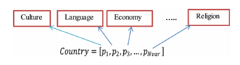
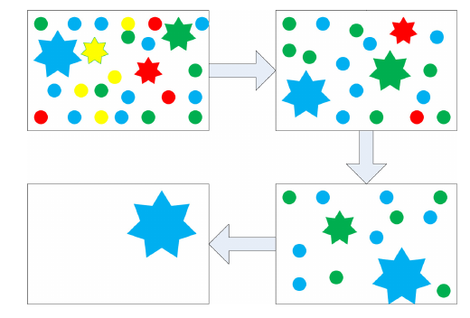
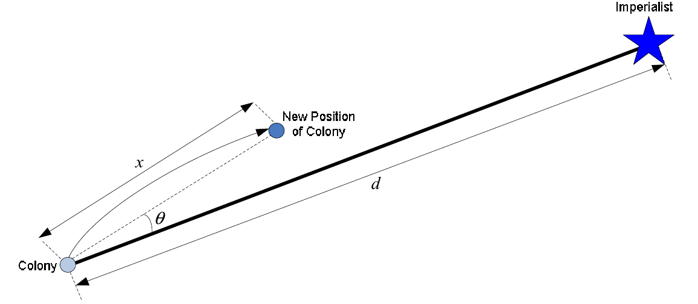
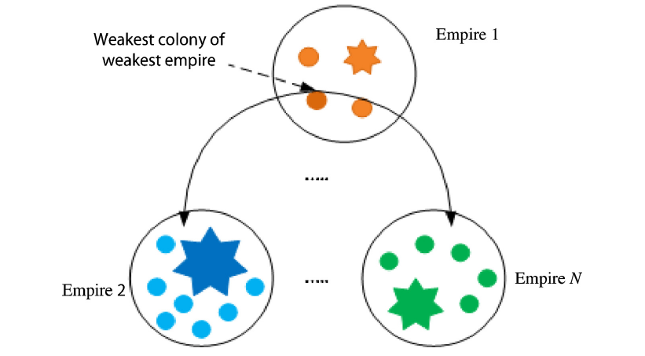
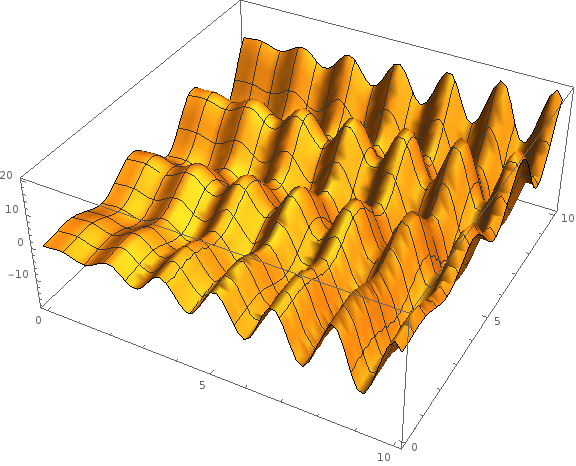
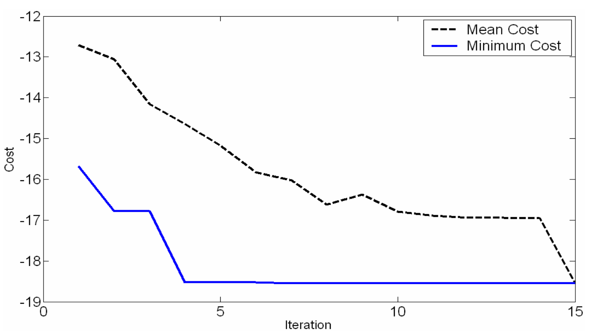
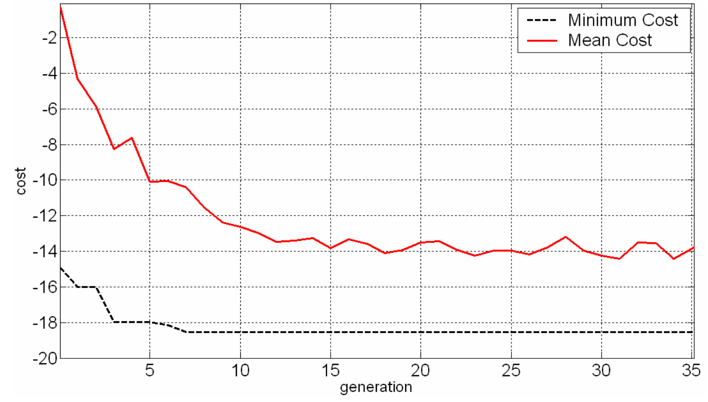
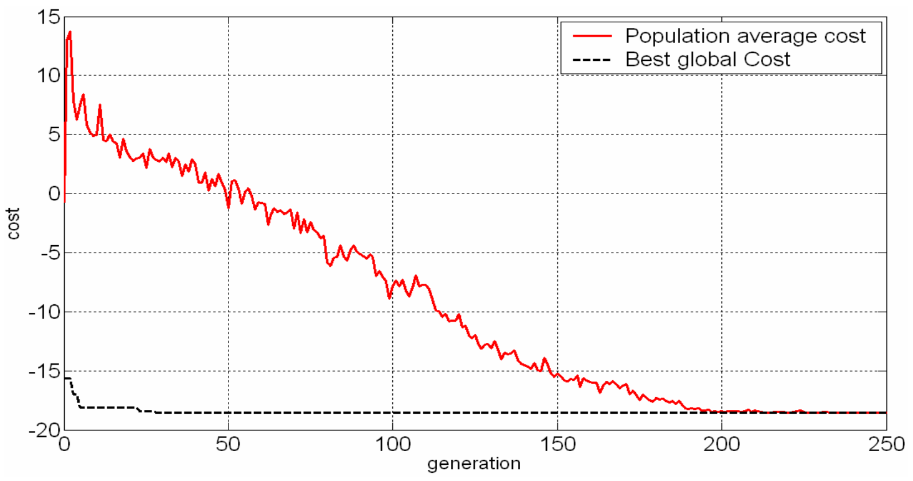
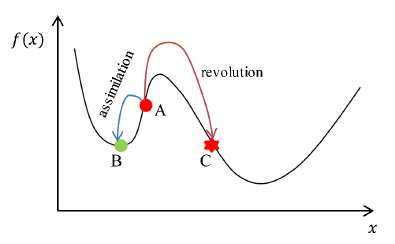

# ICA

:::::::::::::: {.columns}
::: {.column width="50%"}
- Basado en el imperialismo y colonialismo
- Las soluciones (**países**) se dividen en **imperios** y **colonias**
- Las colonias se asimilan y los imperios compiten

:::
::: {.column width="50%"}

:::
::::::::::::::

# Algoritmo

:::::::::::::: {.columns}
::: {.column width="40%"}

:::
::: {.column width="60%"}
- Asimilación de colonias 
- Competición por las colonias 
- Eliminación de imperios
:::
::::::::::::::

# Comparativa

:::::::::::::: {.columns}
::: {.column width="50%"}

:::
::: {.column width="50%"}

:::
::::::::::::::

Aplicamos ICA para minimizar $f(x) = x\sin(4x) + 1,1y\sin(2y)$.

# Comparativa

:::::::::::::: {.columns}
::: {.column width="50%"}

:::
::: {.column width="50%"}

:::
::::::::::::::

La convergencia de ICA es más rápida, aunque el número de parámetros a ajustar es mayor.

# Posibles mejoras

:::::::::::::: {.columns}
::: {.column width="40%"}

- Búsqueda local
- Revoluciones
- Adaptación de parámetros
- Asimilación en más dimensiones
:::
::: {.column width="60%"}

:::
::::::::::::::

