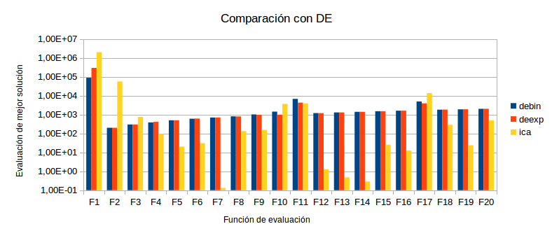

# ICA

Es un algoritmo evolutivo basado en poblaciones aplicable a problemas de optimización en variables reales para funciones definidas sobre un convexo de cualquier dimensión. También se han propuesto versiones para problemas discretos.

Esta inspirado en el fenómeno del colonialismo y el imperialismo: las soluciones son países divididos en imperios que se asimilan hacia el imperialista.

Podemos verlo como un algoritmo de optimización de enjambre de partículas con varias subpoblaciones que propone como novedad una forma de interacción entre las distintas subpoblaciones (competición imperialista).

---

:::::::::::::: {.columns}
::: {.column width="40%"}

:::
::: {.column width="60%"}
Los aspectos fundamentales son:

- Creación del imperio
- Asimilación de colonias
- Posesión del imperio
- Competición por las colonias
- Eliminación de imperios
:::
::::::::::::::

---

En la **creación del imperio** cada imperialista se lleva un número de colonias $\mathrm{NC}_i$ en función de su poder $P_i$:
\begin{equation*}
  P_i = \begin{cases}
  1,\!3 c_\mathrm{máx} - c_i & \text{si } c_\mathrm{máx} > 0 \\
  0,\!7 c_\mathrm{máx} - c_i & \text{si } c_\mathrm{máx}\leq 0
  \end{cases}, \quad
\mathrm{NC}_i = \left[ \left|\frac{P_i}{\sum_1^{N_\mathrm{imp}} P_j}\right| (N - N_\mathrm{imp})\right]
\end{equation*}

---

En la **asimilación** para cada colonia $c$ con imperialista asociado $e$ toma $\delta \sim U([0,\beta]^d)$ un vector aleatorio donde $\beta$ es un parámetro y actualiza:

$$c \leftarrow c + \delta(e-c)$$

En la **posesión** se coloca como imperialista a la mejor colonia si esta supera en calidad al imperialista.
A continuación se actualiza el coste total del imperio en función del coste de las colonias.

---

Finalmente en la **competición** se toma la peor colonia del peor imperialista y se la da aleatoriamente a otro imperialista con selección por ruleta en función del coste normalizado $E_i$:
$E_i = \max( \mathrm{CosteTotal}(e_j)) - \mathrm{CosteTotal}(e_i)$.

# Versiones alternativas

Se han descrito varias versiones alternativas:

- *ICA con mecanismo de globalización*: la asimilación se hace parcialmente hacia el mejor imperialista y no sólo hacia al que pertenece la colonia. Además implementa un mecanismo de cruce entre imperialistas y entre colonias de un mismo imperio
- *ICA con imperialista artificial*: construye un imperialista artificial e intenta sustituir el peor imperialista por este.
- *ICA adaptativo*: sólo para versiones de dos dimensiones. Modifica el ángulo de rotación (no existente en mayor dimensión) de forma adaptativa en función de la diversidad existente entre las colonias.
- *ICA con búsqueda local*: hibrida el algoritmo imperialista con una búsqueda local para todos los imperialistas o sólo para el mejor.

# Comportamiento del algoritmo

En dimensión 10 el comportamiento del algoritmo es claramente inferior al de las versiones de Differential Evolution en casi todas las funciones. En algunas funciones multimodales (4-6, 12-16) presenta resultados similares.

---

En dimensión 30 ICA supera a los algoritmos DE en las funciones multimodales exceptuando la 10.
En las funciones unimodales (1-3) sigue siendo mucho peor; en funciones híbridas el comportamiento es similar.

# Modificaciones consideradas

No parece mejorar el algoritmo:

1. La modificación del proceso de asimilación cambiando su distribución o haciéndolo determinista
2. La modificación del proceso de asimilación para descartar asimilación de colonias que al asimilarse no mejoren
3. La modificación del proceso de asimilación para hacerlo parcialmente hacia el mejor imperialista
4. El ajuste de parámetros

# Versión memética

En la versión memética en alta dimensión los resultados empeoran bastante: tomando como estadístico la suma de los resultados medios en las funciones de evaluación 2 a 20 los resultados son consistentemente peores tanto cuando la búsqueda local se realiza sólo para el mejor imperialista como cuando se hace para todos los imperialistas.

# ICA-DE

He probado una version hibridada con Differential Evolution (inspirada en la versión de DE que cruza con el mejor) que presenta grandes mejoras en dimensión 10 y mejoras más modestas en dimensión 30. La fórmula de cruce en cada coordenada para cada colonia es:

$$v_{i,G} = x_{i,G} + F(x_{\operatorname{imperialista},G} - x_{i,G}) + F(x_{r1,G} - x_{r2,G})$$

Se mantienen el resto de aspectos del algoritmo aunque el tamaño de la población pasa a ser de 100.

---

Los resultados medios pueden verse en la siguiente gráfica:

# Conclusiones

Como conclusiones principales del estudio podemos deducir que:

- El algoritmo imperialista competitivo parece funcionar mejor en dimensión 30 y en funciones multimodales
- El añadido de la búsqueda local no parece ser rentable con ningún número de iteraciones dedicadas
- La versión hibridada con differential evolution mejora notablemente los resultados en dimensión 10 y más modestamente en dimensión 30.
- Existen aún posibilidades de mejora del algoritmo que no he explorado con todo detalle
